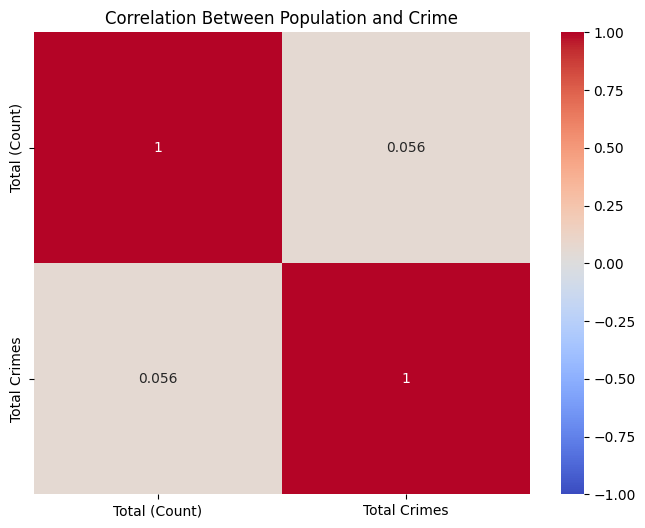
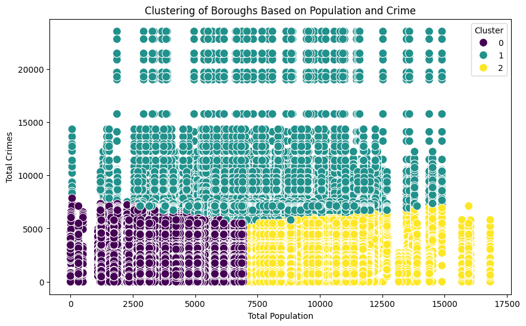
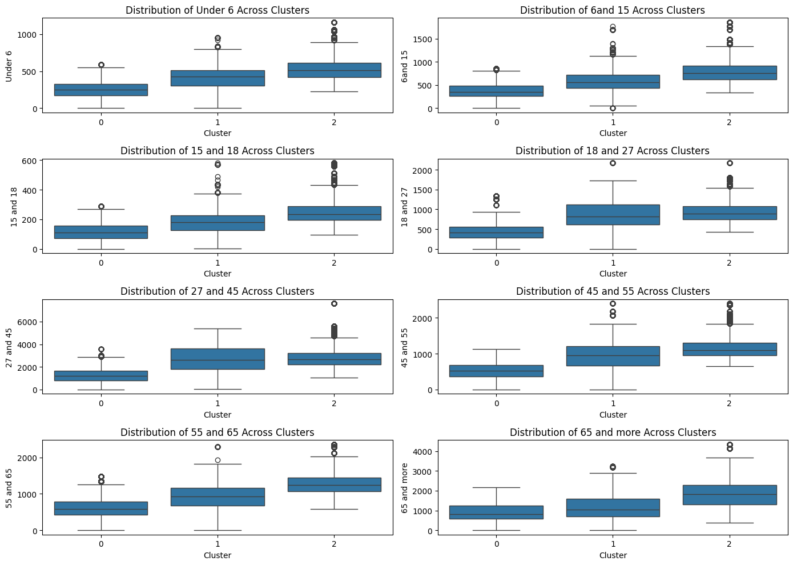
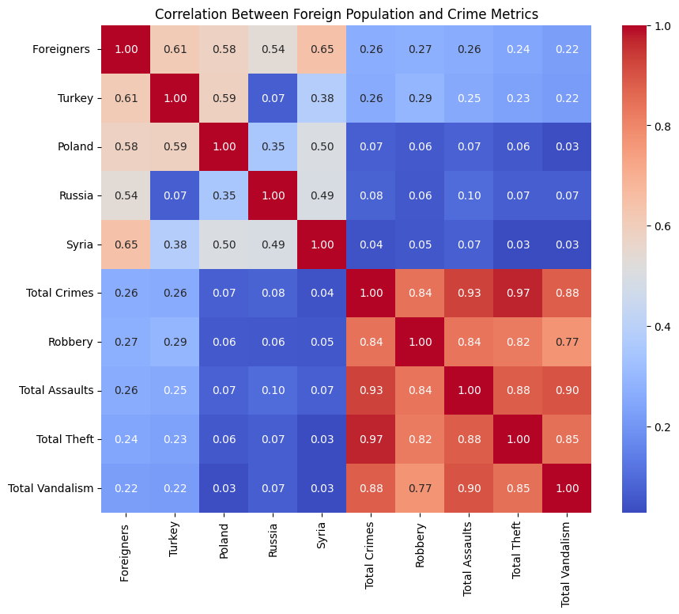

# Analysis of Foreign Population and Crime in Berlin

## Introduction
This analysis aims to explore potential correlations between the presence of foreign population groups and crime metrics across Berlin boroughs. The study investigates specific foreign groups such as Turkish, Polish, Russian, and Syrian populations and looks at various crime metrics, including total crimes, robbery, assault, theft, and vandalism.

## Key Findings

### 1. Correlation Between Population and Crime

- This heatmap shows the correlation between the total population and total crime counts.
- **Observation:** There is a minimal correlation (0.056) between population size and crime, suggesting that overall population size alone is not a strong predictor of crime rates.

### 2. Clustering of Boroughs Based on Population and Crime

- Boroughs are grouped into clusters based on similarities in population size and crime levels.
- **Observation:** The clusters suggest that boroughs with similar characteristics in population and crime metrics can be grouped together, although this clustering does not indicate causation.

### 3. Age Group Analysis Across Clusters

- Box plots showing the distribution of various age groups across different clusters.
- **Observation:** Cluster differences can be observed in certain age groups, particularly in the younger and middle-age demographics, potentially indicating age-related trends in crime rates.

### 4. Foreign Population and Crime Correlation Matrix

- This matrix provides correlations between specific foreign population groups and different types of crime.
- **Key Findings:**
  - **Turkey**: Moderate correlation with total crimes (0.26) and robbery (0.29).
  - **Syria**: Shows a moderate correlation with overall crime (0.26) and assault (0.25).
  - **Poland and Russia**: Show lower correlations with crime metrics, suggesting a lesser direct impact on crime rates.

## Conclusion
This analysis reveals some interesting insights regarding the foreign population and crime in Berlin:
- There is a low overall correlation between population size and crime.
- Foreign populations from specific regions, such as Turkey and Syria, exhibit a moderate correlation with certain crime types.
- Clustering indicates that certain boroughs share similar patterns in population and crime, but further investigation is needed to understand the underlying factors.

This analysis could benefit from additional time-series data to observe changes in trends over time, as well as more granular data on socioeconomic factors, which may play a significant role in explaining these patterns.

---

*Note:* Images are located in the `images` folder in the project repository. Make sure to replace the file paths if you use a different directory structure.
